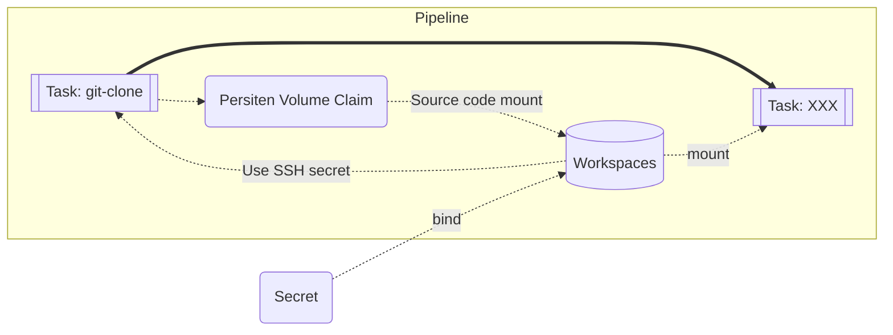

# はじめに

OpenShift Pipelines での CI/CD の実装する機会があったのですが、GitHub のプライベートリポジトリからクローンする際に割と苦戦したので、その際やったことを備忘録として残しておきます。

ちなみに OpenShift Pipelines は Tekton という OSS をベースに作られています。
https://tekton.dev/

検証するにあたって、作成したサンプルコードを下記に置いております。興味のある方は参考にしていただけると幸いです。

https://github.com/ega4432/tekton-git-clone-private-repo

今回の検証ではローカルに OpenShift 環境を構築できる [Red Hat CodeReady Containers](https://developers.redhat.com/products/codeready-containers/overview)（以下 CRC）を使用しています。

CRC の導入については別記事を書きましたので、興味のある方は是非参考にしてみてください。

https://zenn.dev/ysmtegsr/articles/b51865f5e01f5af0869c

また動作環境の詳細については下記になります。

 key | value
 :---: | :---:
OS | macOS Moneterey 12.1
CRC | v1.38.0+659b2cbd
OpenShift | v4.9.12

# 方針

Tekton Pipeline でプライベートリポジトリをクローンする方法については、下記のドキュメントで紹介されています。

https://hub.tekton.dev/tekton/task/git-clone

> 1.The simplest approach is to bind an ssh-directory workspace to this
Task.
> 2. Use Tekton Pipelines' built-in credentials support

`Cloning Private Repositories` で 2 つ挙げられているうち、よりセキュアな認証として推奨されている 1 つ目をやってみたのでその手順をまとめました。

全体感を可視化すると下記のようになっています。SSH の秘密情報を含んだ Secret を Task で使用し、プライベートリポジトリへの認証を可能にしています。また、クローンとしてソースコードを永続ボリューム（Workspaces）に保存することで後続の Task でも使用できるようになっています。



# 事前準備

## Operator のインストール

下記コマンドで Web コンソールを開き、Operator をインストールします。

```sh
$ crc console
```

添付画像のように RedHat OpenShift Pipelines がインストール済みになれば OK です。


## Secret の作成

SSH で認証するために必要な Secret を作成します。(公開鍵は GitHub アカウントに登録しておく必要があります。)

```yaml:secret.yaml
apiVersion: v1
kind: Secret
metadata:
  name: ssh-credential
data:
  id_rsa: # cat ~/.ssh/id_rsa | base64
  config: # cat ~/.ssh/config | base64
  known_hosts: # cat ~/.ssh/known_hosts
```

data の各プロパティには、コメントで書いているコマンドで base64 エンコードされた文字列をペーストします。

イメージとしては `.ssh` ディレクトリ作成し、それを Pipeline 上のワークスペースにバインドする感じだと解釈しています。

```sh
$ oc apply -f secret.yaml
```

# Tekton Task, Pipeline の作成

## Tekton Task のインストール

Pipeline で使用する `git-clone` という Task は Tekton Hub に公開されているものを使用します。そのため事前にインストールする必要があります。

https://hub.tekton.dev/tekton/task/git-clone

インストールするには、下記の**いずれかの**コマンドを実行します。

```sh
$ tkn hub install task git-clone
# OR
$ oc apply -f https://raw.githubusercontent.com/tektoncd/catalog/main/task/git-clone/0.5/git-clone.yaml
```

## 確認用の Task の作成

プライベートリポジトリのクローンの結果を確認するため、確認用に Task を作っておきます。内容としてはクローンしたリポジトリの README を cat するだけの Task です。

```yaml:task.yaml
apiVersion: tekton.dev/v1beta1
kind: Task
metadata:
  name: output-readme
spec:
  workspaces:
  - name: source
  steps:
  - name: output-readme
    image: busybox:latest
    script: |
      #!/bin/sh
      set -eux
      cd workspace/source
      if [ -f README.md ]; then
        cat README.md
      else
        echo "Not found README.md"
        exit 1
      fi
```

## Pipeline の作成

続いて本記事の一番の目的である Pipeline リソースを作成します。
最初に GitHub からクローンする Task を実行し、先程作成した確認用の Task を実行する流れで定義していきます。

```yaml:pipeline.yaml
apiVersion: tekton.dev/v1beta1
kind: Pipeline
metadata:
  name: clone-git-private-repo
spec:
  workspaces:
    - name: my-workspace
    - name: ssh-creds  # ⭐️ Pipeline Run で詳細を定義（後述）
  params:
    - name: private-github-repo-url
      description: The private GitHub repository URL
      type: string
      default: git@github.com:ega4432/private-repository.git
    - name: revision
      description: The private GitHub revision to use
      type: string
      default: main
  tasks:
    - name: clone-private-repo
      params:
        - name: url
          value: $(params.private-github-repo-url)
        - name: revision
          value: $(params.revision)
      taskRef:
        kind: Task
        name: git-clone
      workspaces:
        - name: output
          workspace: my-workspace
        # ⭐️ ssh-directory に spec.workspaces[1].name で定義した ssh-creds を指定
        - name: ssh-directory
          workspace: ssh-creds
    - name: output-readme
      # Task を直列に実行するため runAfter を使用
      runAfter:
        - clone-private-repo
      taskRef:
        kind: Task
        name: output-readme
      workspaces:
        - name: source
          workspace: my-workspace
```

`git-clone` Task のワークスペース `ssh-directory` に対して Secret で作成して秘密鍵などのデータを渡せるように `ssh-creds` というワークスペースを定義しておきます。

```sh
$ oc apply -f task.yaml,pipeline.yaml

$ oc get tasks,pipelines
NAME                            AGE
task.tekton.dev/git-clone       5s
task.tekton.dev/output-readme   3s

NAME                                         AGE
pipeline.tekton.dev/clone-git-private-repo   2s
```

# Pipeline Run を定義して実行

Tekton では Pipeline Run というリソースで任意の Pipeline を指定することで Pipeline を実行できます。

```yaml:pipeline-run.yaml
apiVersion: tekton.dev/v1beta1
kind: PipelineRun
metadata:
  generateName: clone-git-private-repo-run-
  labels:
    tekton.dev/pipeline: clone-git-private-repo
spec:
  pipelineRef:
    name: clone-git-private-repo
  params:
    - name: private-github-repo-url
      value: git@github.com:ega4432/private-repository.git # 実際に確認したいリポジトリを指定
  workspaces:
    # PVC を発行
    - name: my-workspace
      volumeClaimTemplate:
        spec:
          accessModes:
          - ReadWriteOnce
          resources:
            requests:
              storage: 1Mi
    # ⭐️ 作成した Secret を ssh-creds というワークスペース名でバインド
    - name: ssh-creds
      secret:
        secretName: ssh-credential
```

2 点補足で解説します。

1 つ目は、クローンしたソースコードを Pipeline 内で使い回すため PVC を定義しています。一般的に CI/CD を実装する際は、ビルドやテストなど複数 Task を跨ぐことが多く、その場合 Task 間でデータの受け渡しが必要となります。そのため PVC, PV を使用しています。

2 つ目は、Pipeline で定義した `ssh-creds` ワークスペースに Secret をバインドさせている点です。そうすることで、`git-clone` Task での SSH 認証を可能にしています。

また試しにご自身のプライベートリポジトリで試したい場合は `spec.params[0].private-github-repo-url.value` に `git@` から始まる SSH 形式で指定してみて下さい。

ここまでできたら Pipeline Run を実行します。

Tekton の Task は実質 Pod なので正常に起動しているかどうかということや、Pipeline 内のデータ保持のため使われる PVC が生成されているかどうかも確認できます。

```sh
# Pipeline Run を実行
$ oc create -f pipeline-run.yaml

# Pipeline に定義した Task 2 分の Pod が生成されているのが分かる
# Pipeline Run と紐づくかたちで PVC が生成されている様子も確認できる
$ oc get pod,pvc
NAME                                                              READY   STATUS      RESTARTS   AGE
clone-git-private-repo-run-99p5q-clone-private-repo-j7k4t-q85wh   0/1     Completed   0          21s
clone-git-private-repo-run-99p5q-output-readme-xfz78-pod-klpwg    0/1     Completed   0          14s

NAME             STATUS   VOLUME   CAPACITY   ACCESS MODES   STORAGECLASS   AGE
pvc-7fb25cb973   Bound    pv0009   100Gi      RWO,ROX,RWX                   6s
```

実行結果を tkn コマンドを使って確認してみます。

```sh
# Pipeline Run の一覧を出力
$ tkn pipeline list
NAME                               STARTED          DURATION     STATUS
clone-git-private-repo-run-99p5q   1 minutes ago    19 seconds   Succeeded

# 最新の Pipeline Run のログを出力
$ tkn pipeline logs --last --follow
```

正常にクローンができたら、結果として README の内容が出力されます。


```markdown
# private-repository

This is a private GitHub repository.
You have successful cloned this repository 🥳
```

:::details ログの詳細を確認する

```sh
$ tkn pipeline logs --last --follow
[clone-private-repo : clone] + '[' false '=' true ]
[clone-private-repo : clone] + '[' true '=' true ]
[clone-private-repo : clone] + cp -R /workspace/ssh-directory /tekton/home/.ssh
[clone-private-repo : clone] + chmod 700 /tekton/home/.ssh
[clone-private-repo : clone] + chmod -R 400 /tekton/home/.ssh/config /tekton/home/.ssh/id_rsa /tekton/home/.ssh/known_hosts
[clone-private-repo : clone] + '[' false '=' true ]
[clone-private-repo : clone] + CHECKOUT_DIR=/workspace/output/
[clone-private-repo : clone] + '[' true '=' true ]
[clone-private-repo : clone] + cleandir
[clone-private-repo : clone] + '[' -d /workspace/output/ ]
[clone-private-repo : clone] + rm -rf /workspace/output//README.md
[clone-private-repo : clone] + rm -rf /workspace/output//.git
[clone-private-repo : clone] + rm -rf '/workspace/output//..?*'
[clone-private-repo : clone] + test -z
[clone-private-repo : clone] + test -z
[clone-private-repo : clone] + test -z
[clone-private-repo : clone] + /ko-app/git-init '-url=git@github.com:ega4432/private-repository.git' '-revision=main' '-refspec=' '-path=/workspace/output/' '-sslVerify=true' '-submodules=false' '-depth=1' '-sparseCheckoutDirectories='
[clone-private-repo : clone] {"level":"warn","ts":1645211896.5353374,"caller":"git/git.go:277","msg":"URL(\"git@github.com:ega4432/private-repository.git\") appears to need SSH authentication but no SSH credentials have been provided"}
[clone-private-repo : clone] {"level":"info","ts":1645211899.375549,"caller":"git/git.go:169","msg":"Successfully cloned git@github.com:ega4432/private-repository.git @ 82f18c58b704ee894f2f0ee4987bfe0c361a435e (grafted, HEAD, origin/main) in path /workspace/output/"}
[clone-private-repo : clone] + cd /workspace/output/
[clone-private-repo : clone] + git rev-parse HEAD
[clone-private-repo : clone] + RESULT_SHA=82f18c58b704ee894f2f0ee4987bfe0c361a435e
[clone-private-repo : clone] + EXIT_CODE=0
[clone-private-repo : clone] + '[' 0 '!=' 0 ]
[clone-private-repo : clone] + printf '%s' 82f18c58b704ee894f2f0ee4987bfe0c361a435e
[clone-private-repo : clone] + printf '%s' git@github.com:ega4432/private-repository.git

[output-readme : output] + cd workspace/source
[output-readme : output] + '[' -f README.md ]
[output-readme : output] + cat README.md
[output-readme : output] # private-repository
[output-readme : output]
[output-readme : output] This is a private GitHub repository.
[output-readme : output]
[output-readme : output] You have successful cloned this repository 🥳
```

:::

# まとめ

今回はプライベートリポジトリを Tekton Pipeline 上でクローンする方法についてまとめてみました。CI/CD を実装する上では、ソースコードをクローンして何か処理させるということは避けては通れない道なので学びとしていい機会でした。一方で、クローンするだけで意外と手順が多い印象を持ったので、もう少し楽にできるようになれば嬉しいです。

# 参考にさせていただいたサイト

https://qiita.com/mamomamo/items/ba8e2476ca80e9f90b3d
https://redhat-scholars.github.io/tekton-tutorial/tekton-tutorial/private_reg_repos.html
https://hub.tekton.dev/tekton/task/git-clone
https://github.com/tektoncd/pipeline/issues/1983
https://qiita.com/_mkazutaka/items/f4848cf507428fc0a006
